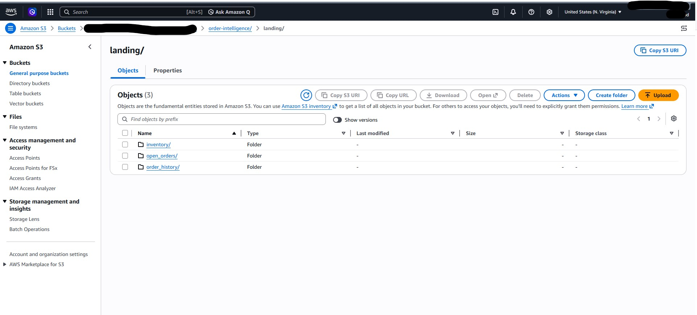
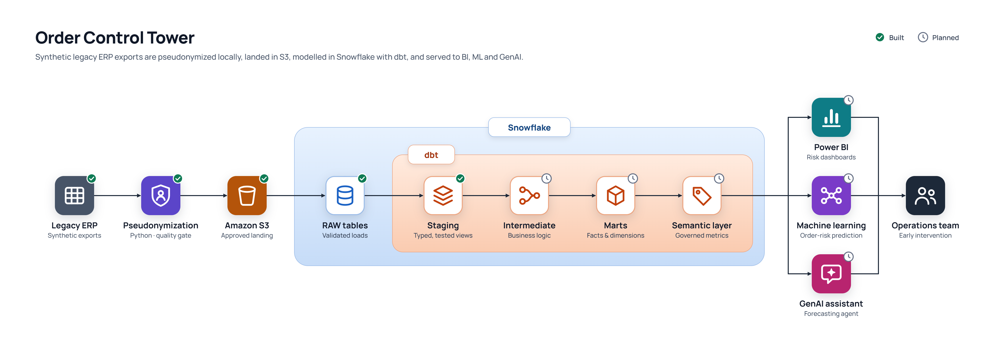

# Order Control Tower

Turns raw synthetic legacy ERP exports containing synthetic sensitive customer, product, and employee data into privacy-safe, analytics-ready datasets — built because the source system has no API, direct database connection, or automated extraction.

A local-first Python pipeline that builds stable shared identities, pseudonymizes synthetic sensitive fields, validates order history, open orders, and inventory, lands only approved batches in Amazon S3, loads validated observations into Snowflake RAW tables, and exposes documented dbt staging views.

**Scale tested:** a full Python-to-S3 run handles hundreds of thousands of order rows in a few minutes on a single machine. The current Python suite contains 79 collected tests covering ingestion, orchestration, mapping integrity, SQL execution, warehouse loading, and rollback scenarios; dbt adds separate SQL data checks.

## Story Behind the Project
High-volume supply chain operations often manage customer commitments using fragmented legacy system reports. Historical orders show what already happened, open orders show current commitments, and inventory snapshots show current availability—but none independently answers the question management actually needs answered:
**Which customer commitments are at risk, why, and where should operations intervene before service fails?**
Order Control Tower trnasform these fragmented operational datasets into a governed analytics layer for workload visibility, inventory risk, capacity planning and proactive customer-service decision support.

## Business Flow Infographic

<p align="center">
  
  <br>
  <strong>Legacy ERP — Excel Exports</strong>
  <br><br>
  ↓
  <br><br>

  
  <br>
  <strong>Python Pipeline</strong>
  <br>
  Ingest • Standardize • Pseudonymize • Validate
  <br><br>
  ↓
  <br><br>

  
  <br>
  <strong>Approved Amazon S3 Dataset</strong>
  <br><br>
  ↓
  <br><br>

  
  <br>
  <strong>Snowflake RAW + dbt staging</strong>
  <br><br>
  ↓
</p>

<p align="center">
  
  
  
</p>

<p align="center">
  <strong>Power BI / Machine Learning / Generative AI — Planned</strong>
</p>


## Highlights

- **3 complete data pipelines** — order history, open orders, and inventory
- **Tested at scale** — hundreds of thousands of rows through pseudonymization, validation, and S3 landing in a single run
- **79 collected Python tests** covering ingestion, orchestration, mapping integrity, SQL execution, warehouse publication, and rollback behavior
- **Three Snowflake loaders** preserve earlier observations and replace only the selected source file or inventory snapshot date
- **Two dbt staging views** standardize order history and open orders, retain source lineage, and exclude untrusted order amounts
- **Stable shared identities** for customers, products, and SKUs across datasets and pipeline runs
- **Privacy before cloud** — direct customer, product, and employee identifiers are removed before S3 upload
- **Failure-isolated dataset tracks** — one dataset failure does not prevent independent datasets from completing
- **Quality-authorized S3 landing** — failed or mismatched quality reports cannot authorize an upload
- **No source data** committed to the repository

**What's in this repo:** pipeline code, configuration, documentation, automated tests, and screenshots from a run. Runtime data, identity mappings, logs, Excel exports, CSV outputs, quality reports, and credentials are excluded by `.gitignore`.

## Status

| Piece | Status |
|---|---|
| Shared identity foundation | Complete |
| Order history pipeline | Complete |
| Open orders pipeline | Complete |
| Inventory snapshot pipeline | Complete |
| Mapping-integrity validation | Complete |
| Privacy validation and quality gates | Complete |
| S3 landing | Complete |
| Python test suite | 79 tests collected locally; warehouse tests use offline fixtures/mocks |
| CI | Not configured yet |
| Snowflake RAW loading | Implemented for order history, open orders, and inventory |
| dbt sources | All three RAW tables declared |
| dbt staging | Order history and open orders implemented with data tests |
| Inventory staging / analytical marts | Planned |
| Airflow | Planned |
| BI / ML | Planned |

## Why this exists

Order history, open orders, and inventory all come from the same legacy ERP. Extracting the data requires manually refreshed Excel exports because there is no API, direct database connection, or scheduler. Those exports hold customer names, product descriptions, SKU codes.

The goal is to make that data usable for analytics without allowing direct customer and product identifiers to flow into the cloud. The pipeline establishes stable pseudonymous identities locally, removes the raw identifiers, validates the result, and only then allows an approved batch to reach S3.

Local files remain the interface between Python preparation stages. Approved S3 files now feed Snowflake RAW tables, while dbt staging views make source types, record identity, and approved measures explicit. Scheduling remains a separate future layer.

The repository now covers ingestion, privacy checks, S3 landing, Snowflake RAW publication, and initial dbt staging. Dashboards, analytical marts, forecasting, and production scheduling remain future deliverables.

For the reasoning behind specific design choices, known tradeoffs, and issues discovered during development, see **[docs/DECISIONS.md](docs/DECISIONS.md)**.

## Scale

The pipeline has been run end-to-end on full-size extracts: order history in the hundreds of thousands of rows, open orders and inventory in the thousands. A full run, including pseudonymization, validation, quality gating, and Amazon S3 delivery, completes in a few minutes on a single machine. That timing predates the Snowflake loading and dbt layers.

No source data is included in this repository. Automated tests create temporary synthetic fixtures at runtime.


## Pipeline Output




*Quality-approved pseudonymized datasets landed in Amazon S3.*

More screenshots, including the stage status table, are available in [docs/images](docs/images).

## Architecture



The Python execution model has one shared foundation followed by three dataset tracks. Each track now continues from S3 into Snowflake; dbt runs separately afterward:

```text
shared foundation
├── ingest and standardize order history
├── profile and map customers
├── profile and map products
├── assign stable SKU identities
└── validate both shared mapping files
        │
        ├── order history
        │   └── pseudonymize → validate → quality gate → S3 -> Snowflake RAW
        │
        ├── open orders
        │   └── ingest → standardize → backfill missing products/customers
        │       → pseudonymize → validate → quality gate → S3 -> Snowflake RAW
        │
        └── inventory
            └── ingest → standardize → backfill missing products
                → pseudonymize → validate → quality gate → S3 -> Snowflake RAW
```

### Why order history builds the foundation

The source system does not provide clean master customer, product, or SKU tables. Order history is therefore used to seed the shared identity mappings. Existing pseudo identifiers are preserved across runs, and only previously unseen entities receive new identifiers.

Open orders can contain a customer or product that has not reached order history yet. Inventory can contain a product that has never been ordered. Their backfill stages add only those missing entities to the existing shared mapping before pseudonymization. Open orders and inventory use an explicit `Unknown Category` pseudonymous bucket when their sources do not provide a trustworthy product category.

The shared mappings are validated before any dataset track consumes them. The validator checks required columns, null identifiers, duplicate join keys, split identities, pseudo-identifier collisions, and expected pseudonym formats.

### Failure isolation

A critical failure in the shared foundation stops the entire run because none of the dataset tracks can safely trust incomplete or corrupted mappings.

After the foundation succeeds, each dataset is isolated:

- An order-history failure stops only the order-history track.
- An open-orders failure stops only the open-orders track.
- An inventory failure stops only the inventory track.
- A failed validation or quality gate prevents that dataset's upload.
- An S3 or Snowflake failure does not stop the remaining dataset tracks.

Tracks execute sequentially because open orders and inventory can update the same local product mapping file. They are failure-isolated, but they are not run concurrently.

The run report records each track as `completed` or `failed`, and summarizes the whole run as:

- `completed`: every selected dataset track succeeded
- `partially_completed`: at least one selected dataset succeeded and at least one failed
- `failed`: the shared foundation failed, or every selected dataset track failed

Every stage remains a standalone Python script. `run_pipeline.py` orchestrates them as subprocesses, captures their output in a timestamped log, and writes a structured JSON run report. It is intentionally a lightweight bridge toward a future scheduler, not a replacement for Airflow.

## Snowflake loading and dbt staging

### Validated RAW publication

The three loaders share [load_snapshot.py](src/warehouse/load_snapshot.py). Before publication, they check the matching local quality report and CSV, load the selected S3 file into temporary tables, and validate counts, source identifiers, and file metadata. Order-history dates are parsed and checked before RAW changes.

| Dataset | Replacement boundary | History retained |
|---|---|---|
| Order history | Selected source filename | Earlier rolling-window observations |
| Open orders | Selected source filename | Earlier backlog observations |
| Inventory | Selected snapshot date | Earlier inventory dates |

Publication uses a transaction: delete the selected partition, insert the validated replacement, and roll back if publication fails. Source ingestion IDs remain distinct from privacy-run filename IDs and Snowflake load timestamps. These checks establish lineage and control flow; they are not a checksum of every business value.

### Staging contracts

| Model | Implemented behavior |
|---|---|
| `stg_order_history` | Preserves source records, quantities, typed dates, and file lineage; excludes unreliable `order_amount` |
| `stg_open_orders` | Preserves quantities and weights; converts four YYYYMMDD fields to dates and source `0` placeholders to NULL; casts operational codes to text; excludes zero-valued `order_amount` |

Both models are views. Eight custom SQL tests check source-position uniqueness, row-count preservation, quantity/measure preservation, open-order date conversion, and the open-order candidate key. YAML properties add column-level checks.

Technical record identity is `source_filename + source_file_row_number`. Company, order number, and SKU are not unique in order history. That combination is a candidate key in the reviewed open-orders extract, not a confirmed permanent source contract. The staging views currently read all loaded RAW rows; a latest-snapshot selection or cross-snapshot reconciliation layer is still needed before treating them as current-state business facts.

Open orders describe the ready-to-pick extract. Disappearance in a later file does not prove shipment or completion. Neither staging model supplies an approved revenue measure. See the [order-history decisions](docs/dbt/order_history_staging_notes.md) and [open-orders decisions and unresolved business questions](docs/dbt/open_orders_staging_notes.md).

### Run the warehouse layers

Review the scripts in [snowflake/setup](snowflake/setup) when provisioning the database, stage, tables, and loader permissions. Python loading requires `SNOWFLAKE_ACCOUNT`, `SNOWFLAKE_USER`, and `SNOWFLAKE_PASSWORD` in the terminal environment, plus a fresh `SNOWFLAKE_PASSCODE` when MFA is required. Role, warehouse, database, and schema have project defaults that can be overridden. The [connection helper](src/warehouse/snowflake_conn.py) does not automatically read `.env`.

With the matching approved local CSV, quality report, and S3 object available:

```powershell
# Explicit privacy-run filename identifiers; replace with approved batch IDs
python src/warehouse/load_order_history_to_snowflake.py --batch-id <YYYYMMDD_HHMMSS>
python src/warehouse/load_open_orders_to_snowflake.py --batch-id <YYYYMMDD_HHMMSS>
python src/warehouse/load_inventory_to_snowflake.py --snapshot-date <YYYYMMDD>
```

The Python runner already includes these loaders after each upload. Standalone commands are for deliberate individual loads or retries; run one writer at a time.

The dbt project lives in `dbt/` and uses profile `default`. Configure its Snowflake connection in dbt Studio, or supply a local profile and a dbt environment with the Snowflake adapter; the Python requirements do not install dbt. Run these commands from the dbt project directory:

```text
dbt build --select stg_order_history stg_open_orders
```

Inventory is declared as a RAW source, but its staging model is not yet implemented. dbt is not invoked by the Python runner.

## Privacy boundary

Worth being precise about what “pseudonymized” means here:

- Customer names, product descriptions, and SKU codes are replaced with stable fake identifiers from the shared local mappings.
- Open orders' `delivery_route_name` (free text that routinely embeds a customer name and city/province, e.g. `"Acme Market - ANYTOWN (XX)"`) is replaced with a stable pseudo route name (`"Route RT-000042"`) from its own local mapping (`data/metadata/route_name_mapping_final.csv`, built by `route_name_mapping_pipeline.py`). This field is open-orders-only — order history has no equivalent. `delivery_route` (the numeric code) is left unmasked, deliberately — see `docs/DECISIONS.md`.
- `source_customer_code`, `ship_to_customer_code`, mapping helper columns, and employee usernames are removed before final order outputs are written.
- Inventory's raw SKU is removed before its final output is written.
- `company_code` remains present (required by the current output contract and quality gates, and retained for downstream grouping), but the literal value is replaced with a same-length deterministic pseudonym before upload, same treatment as `purchase_order_number` and `warehouse_code`.
- The mapping files contain the relationship between source and pseudo identities. They remain local, are excluded from Git, and are never uploaded to S3.
- This is pseudonymization, not anonymization. Dates, routes, quantities, amounts, order numbers, warehouse positions, and other operational context can still be sensitive.
- `order_number` remains unchanged; it serves as an operational transaction identifier in this environment.
- `purchase_order_number` (order history, open orders) and `warehouse_code` (inventory) are replaced with a same-length deterministic pseudonym (`deterministic_pseudonym()` in `src/privacy/hash_utils.py`) rather than a mapped pseudo identity — same real value always maps to the same pseudonym, so equality comparisons on these pseudonyms remain possible, and the output is the same length as the original rather than a fixed 64-char hash. Short values (roughly 4 characters or fewer) carry real collision risk at this length — see the caveat in `hash_utils.py`.


## Quality gates

Each dataset has its own privacy validator and quality gate. Depending on the dataset, the checks cover:

- required output columns
- non-empty batches
- nulls in critical business and pseudonymous fields
- expected customer, product, and SKU pseudonym formats
- complete deterministic row hashes
- duplicate row hashes, reported as warnings with duplicate exports for inspection
- negative numeric values, reported as warnings
- exact linkage between the dataset's batch or snapshot identifier and its quality report

The S3 upload stage independently reopens the matching quality report and refuses to upload if its status is not `passed` or `passed_with_warnings`. This prevents a stale, mismatched, or failed report from authorizing the wrong dataset.

These are deterministic assertions, not ML-based anomaly detection. They are intended to catch broken schemas, failed pseudonymization, corrupt mappings, empty exports, and suspicious records before the data reaches S3.

## Reproducibility

The repository does not include business exports or committed runtime datasets. Automated tests create temporary synthetic Excel workbooks and mapping CSVs, so ingestion, idempotency, mapping-integrity, and orchestration behavior can be tested without production data.

Running the complete pipeline requires source workbooks matching the schemas described in:

- `config/column_mapping.py`
- `config/column_mapping_open_orders.py`
- `config/column_mapping_inventory.py`

**Runtime requirements:**

```text
Python 3.10+ recommended
AWS credentials with permission to write to the target S3 bucket
```

Install runtime dependencies:

```powershell
python -m pip install -r requirements.txt
```

Install test dependencies and run the suite:

```powershell
python -m pip install -r requirements-dev.txt
python -m pytest -q
```

**Environment variables** required by upload stages:

```powershell
$env:S3_BUCKET = "your-bucket-name"
$env:S3_PREFIX = "order-intelligence"   # optional; this is the default
$env:AWS_REGION = "us-east-1"            # optional; this is the default
```

**Environment variable** required by the pseudonymization stages:

```powershell
$env:PSEUDONYMIZATION_SALT = "<a long random value>"
```

Used by `src/privacy/hash_utils.py` to hash `purchase_order_number`, `company_code`, and (inventory) `warehouse_code` before any pseudonymized file is written. Set it once and keep it stable — changing it changes every hash output, breaking continuity with previously landed data. Not committed to git; store it the same way you'd store any other secret (local env var, secrets manager, etc.).

**Common commands:**

```powershell
# List the exact stages grouped by track
python src\run_script\run_pipeline.py --list

# Preview a full run without executing any stages
python src\run_script\run_pipeline.py --dry-run

# Run the shared foundation and all three dataset tracks through Snowflake RAW
python src\run_script\run_pipeline.py

# Run local processing only: skip both S3 uploads and Snowflake loads
python src\run_script\run_pipeline.py --skip upload_s3 upload_open_orders_s3 upload_inventory_s3 load_snowflake_order_history load_snowflake_open_orders load_snowflake_inventory

# Rebuild and validate only the shared mapping foundation
python src\run_script\run_pipeline.py --track shared

# Run one dataset using existing mappings; mapping integrity is checked first
python src\run_script\run_pipeline.py --track order_history
python src\run_script\run_pipeline.py --track open_orders
python src\run_script\run_pipeline.py --track inventory

# Resume from a stage; later tracks in the global plan may also run
python src\run_script\run_pipeline.py --from pseudonymize_open_orders

# Force ingestion of source files already recorded in their manifests
python src\run_script\run_pipeline.py --force
```

For a standalone non-shared track, the runner automatically prepends the read-only shared-mapping validator. It does not rebuild the foundation. Inventory only uses product mappings at the data level, although the current shared validator verifies both mapping files as one foundation contract.

Every stage can also run directly for focused debugging, for example:

```powershell
python src\privacy\pseudonymize_order_history.py
```

Order history and open orders use microsecond-precision batch identifiers and keep separate ingestion manifests, so processing one sheet never blocks the other sheet from the same workbook. Inventory uses the snapshot date encoded in its source filename and refuses to overwrite an existing snapshot unless `--force` is explicitly supplied.

## Repository structure

```text
src/
├── ingestion/          Separate Excel ingestion for order history, open orders,
│                       and inventory, with dataset-specific idempotency guards
├── standardization/    Schema mapping and drift checks, one script per dataset
├── privacy/            Shared identity construction and validation, backfills,
│                       pseudonymization, and per-dataset privacy validation
├── quality/            Dataset-specific quality gates and reports
├── cloud/              Quality-authorized S3 uploads, one per dataset
└── run_script/         Track-aware subprocess orchestrator
config/
├── paths.py                        Portable directory definitions
├── column_mapping.py               Order-history source schema
├── column_mapping_open_orders.py   Open-orders source schema
└── column_mapping_inventory.py     Inventory source schema
tests/
├── test_ingestion_idempotency.py    Split ingestion, force, and rollback behavior
├── test_run_pipeline.py             Track isolation and run statuses
└── test_validate_shared_mappings.py Mapping integrity and collision checks
docs/
├── DECISIONS.md                    Tradeoffs, limitations, and engineering notes
└── images/                         Architecture and run evidence
```

`data/`, `logs/`, Excel files, CSV files, JSON runtime artifacts, credentials, and local mapping tables are excluded from Git. See `.gitignore`.

Additional warehouse files:

| Path | Purpose |
|---|---|
| `src/warehouse/` | Snowflake connections, SQL execution, and validated loaders |
| `snowflake/setup/` | Infrastructure, RAW table definitions, and grants |
| `dbt/models/staging/` | Three source declarations and two staging views |
| `dbt/tests/` | Eight custom SQL data tests |
| `dbt/analyses/` | Grain, date, and source-identity investigation queries |
| `tests/test_warehouse_loads.py` | Publication boundaries, lineage checks, and rollback scenarios |
| `tests/test_sql_runner.py` | SQL file handling and failure cleanup |
| `docs/dbt/` | Staging decisions and outstanding source-contract questions |

## Known limitations

- Source exports are manual. There is no scheduler or source API, so freshness depends on someone refreshing the workbooks.
- Shared mappings are local CSV files rather than a transactional database. Atomic file replacement and rollback protect individual writes, but concurrent pipeline runs are not supported.
- Order history seeds identity because clean master customer/product/SKU tables are unavailable. Identity quality therefore depends on the source transaction fields used to construct those keys.
- Open-orders-only and inventory-only products do not have a trustworthy source category and are assigned to an explicit `Unknown Category` pseudonymous bucket.
- Customer identity currently includes the normalized customer name. A name correction can therefore create a new identity; the durable-key/SCD2 design is deferred to the warehouse layer.
- Order history, open orders, and inventory can be exported at different times, so one pipeline run is not a perfectly synchronized source snapshot.
- Multi-file ingestion commits are fail-closed and roll back ordinary write failures, but they are not database transactions. An abrupt machine or process termination during the small commit window can require manual inspection and a forced retry.
- Python tests run locally, but CI has not yet been configured. Offline warehouse tests do not verify a live Snowflake connection or execution.
- RAW retains repeated observations across files. Staging preserves those rows; business deduplication, current-state selection, and snapshot reconciliation remain downstream work.
- Inventory staging, analytical marts, and a durable customer dimension are not yet implemented.

## Disclaimer: 
## Data
No source data, identity mappings, pipeline outputs, logs or credentials are stored in this repository. Automated tests generate synthetic fixtures at runtime.

## What's next

Next: build inventory staging, confirm source grain and status/quantity definitions, define snapshot reconciliation and current-state selection, and develop tested analytical marts. A durable customer dimension with SCD2 history remains planned. BI, forecasting or ML, production scheduling, and CI/CD follow once those contracts are established.
